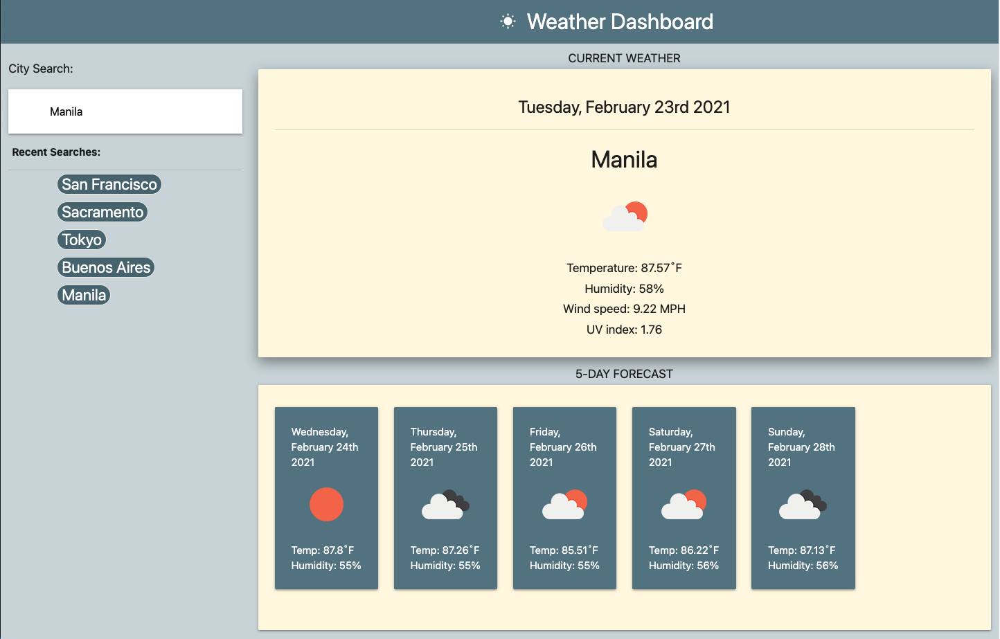

# Weather Dashboard

### Languages And Tools Used:

 
 
 

 
 

 

---

## Description

This is a simple weather app that allows you to check for current weather conditions and a 5-day forecast. It retrieves weather data for cities using the OpenWeather APIs. Searching for multiple cities will give you a clickable search history list you can use to retrieve weather for those cities again.

## Features

This project is created in part to display my ability to work with APIs. I have incorporated two APIs: Current Weather Data API and One Call API by OpenWeather. 

This project features my work with the following:

* Materialize CSS
* Google Fonts
* OpenWeather APIs
* Moment.js

## How it Works
Type in a city in the search bar and the app will dynamically update current weather information and a future forecast.

## How it Looks

## Deployed Link

[Click here to check it out for yourself](https://spclk.github.io/weather-dashboard/)